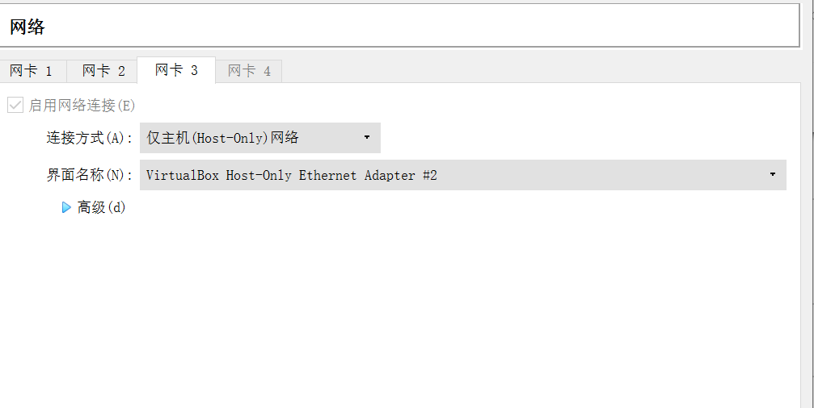
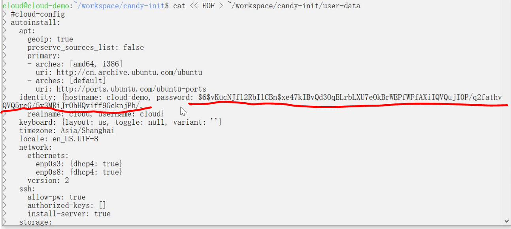

# **第一章：Linux基础实验**
## **软件环境**
---
- Virutualbox
- Ubuntu 20.04 Server 64bit
## **实验问题**
---
- 如何配置无人值守安装iso并在Virtualbox中完成自动化安装。
- Virtualbox安装完Ubuntu之后新添加的网卡如何实现系统开机自动启用和自动获取IP？
- 如何使用sftp在虚拟机和宿主机之间传输文件？
## **Ubuntu20.04无人值守安装过程**
---
1. 事先手动安装好一个Ubuntu20.04

2. 利用ssh远程连接该虚拟机ub20.04-try

3. 从ub20.04-try中获取autoinstall-user-data文件：
-    sudo chown修改文件属主，不然会因为没有权限无法进行下一步操作

-    利用scp操作将autoinstall-user-data文件下载到宿主机

4. 将autoinstall-user-data在vscode打开，并于老师的user-data文件进行比对修改

5. 再次利用ssh连接ub20.04-try，安装genisoimage工具，用于在ubuntu制作iso镜像

6. 在ub20.04-try中利用mkdir建立文件夹candy-init用于存放user-data和meta-data，方便制作iso镜像文件( 下图还利用cat EOF命令直接在candy-init下创建了一个空文档meta-data )

7. 回到宿主机，利用scp命令将user-data传进ub20.04-try的文件夹candy-init中

8. ssh连接ub20.04-try,利用genisoimage命令创建名为candy-init的iso镜像文件,并sudo chown修改文件属主，方便随后的scp传输

9. 在宿主机利用scp从ub20.04-try中获取已经制作好的iso文件，至此iso文件制作完成

10. 新建一个全新的虚拟机，移除控制器ide，在控制器sata下按顺序挂载纯净版 Ubuntu 安装镜像文件后挂载 candy-init.iso( 如下图所示 )

11. 启动后看到continue with autoinstall，写入yes便可以进行无人值守安装

- [我的Ubuntu20.04无人值守安装视频](https://www.bilibili.com/video/BV1Lr4y1P7yw)
## **Virtualbox安装完Ubuntu之后新添加的网卡实现系统开机自动启用和自动获取IP**
---
1. 为装好的虚拟机添加新的host-only网卡

2. 为Ubuntu新添加了网卡，利用ifconfig-a命令查看所有网卡，再用ifconfig命令查看正在工作的网卡，比对看是否有网卡没工作。
- 首先应先装上net-tools

- ifconfig-a命令查看所有网卡,如图可以看见有三个

- ifconfig命令查看工作的网卡，如图可以看见只有两个,enp0s9没工作

3. 利用vim命令进入/etc/netplan/00-installer-config.yaml对其进行修改，手动添加上enp0s9


4. 执行```sudo netplan apply```使得修改生效,再用ifconfig查看可知现在enp0s9也在工作

## **使用sftp在虚拟机和宿主机之间传输文件**
---
1. 利用sftp将宿主机中的文件传输给虚拟机
- pwd:查看远端服务器的目录，lpwd：查看本地目录，put命令即将本地目录的某一文件传输至远端（因为本人做实验时采用的是scp传输文件法，故这里只是建立了一个try文件进行传输测试）

- ssh连接远端服务器，利用cat查看文件传输是否成功(下图可知传输成功)

2. 利用sfrp将虚拟机中文件传输给宿主机
- get命令即将远端某一文件传递给本地目录(下图可知传输成功)

## **实验中遇到的问题及解决方法**
---
1. 利用scp命令将autoinstall-user-data下载到本地时显示权限不足
- **解决方法**

  利用sudo chown命令修改文件属主后便可以进行传输 
2. 最开始我采用的方法是利用cat EOF命令直接在ub20.04-try中写入user-data，制作出iso镜像后进行无人值守安装时成功后发现输入密码出现错误，利用cat对ub20.04-try中我写入的user-data进行查看发现密码那一行莫名进行了删减修改，导致最后安装成功密码出错
如图可看出红色一行为我利用catEOF命令输入的密码
利用cat命令查看写入的文件时却发现密码这一行被莫名进行了删减导致出错
- **解决方法**

  利用scp命令直接将user-data传入到ub20.04-try里建的文件夹candy-init中，经过cat查看发现密码行没有进行改动，便利用这个正确的user-data和meta-data生成了iso，并进行了成功的无人值守安装

## **参考链接**

- [cloud-init](https://github.com/c4pr1c3/LinuxSysAdmin/blob/master/cloud-init.md)
- [制作iso镜像文件](https://github.com/c4pr1c3/LinuxSysAdmin/blob/master/exp/cloud-init/docker-compose/README.md)
- [scp传输文件命令](https://www.runoob.com/linux/linux-comm-scp.html)
- [sftp传输文件命令](https://www.linuxprobe.com/linux-sftp-files.html)
- [ubuntu添加新网卡后自动启用并获取ip](https://blog.csdn.net/xiongyangg/article/details/110206220)