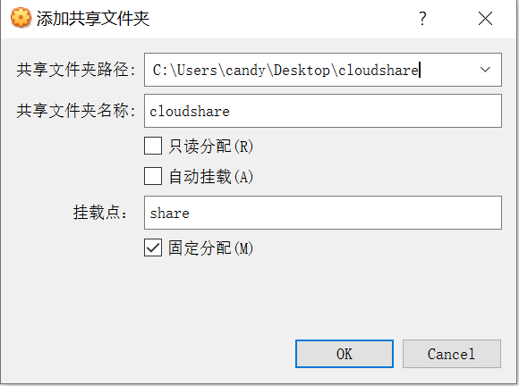

# 第三章实验：动手实战Systemd
## **一、实验环境**
- windows10专业版
- Virtualbox
- Ubuntu 20.04 Server 64bit
## **二、实验目的**
- 利用asciinema进行录屏操作并上传
- 参考systemd入门教程进行实操，了解systemd命令
## **三、实验要求**
- 确保本地已经完成asciinema auth，并在asciinema成功关联了本地账号和在线账号
- 上传本人亲自动手完成的Systemd操作全程录像
- 在自己的github仓库上新建markdown格式纯文本文件附上asciinema的分享URL
- **提醒**避免在终端操作录像过程中暴漏密码、个人隐私等任何机密数据
## **四、实验步骤**
### 一、Systmed入门教程：命令篇
- 系统管理

[](https://asciinema.org/a/6tCv8ACnfB7fHYGMVSF0HyQkq)
- Unit

[](https://asciinema.org/a/W5AdyvHDvqtw7hlmrYyErUqvZ)
- Unit的配置文件

[](https://asciinema.org/a/DdnhEx42kZSIUR5aWXATk3vbi)
- Target

[](https://asciinema.org/a/sTRxIsZtskiFCfx6W87buaD1V)
- 日志管理

[](https://asciinema.org/a/DrD85jTZkz6cSraihswESD5Bs)
### 二、Systmed入门教程：实战篇
- 开机启动，启动服务，停止服务，查看配置文件

[](https://asciinema.org/a/IAhOxmB8NSLHWYVDXJY9nYHOX)
-  [Unit] 区块：启动顺序与依赖关系，[Service] 区块：启动行为，[Install] 区块，Target的配置文件，修改配置文件后重启

[](https://asciinema.org/a/dD7iQvzzykfBxBRjejQzHzB8k)
## **五、自查清单**
1. 如何添加一个用户并使其具备sudo执行程序的权限？
```
sudo adduser cloudy
sudo usermod -a -G sudo cloudy
```
2. 如何将一个用户添加到一个用户组？
```
sudo usermod -a -G <groupname> <username>
```
3. 如何查看当前系统的分区表和文件系统详细信息？
```
#查看分区表
sudo fdisk -l
#查看文件系统详细信息
sudo df -h
```
4. 如何实现开机自动挂载Virtualbox的共享目录分区？
- 在windows下创建共享文件夹【虚拟机-》设备-》共享文件夹】【按下图配置，记得勾选固定分配】



- 在虚拟机中新建共享文件夹``mkdir /mnt/share``
- 进行挂载：``mount-t vboxsf cloudshare /mnt/share``
- 修改 ``/etc/fstab``文件，在文末添加``cloudshare /mnt/share vboxsf default 0 0``
5. 基于LVM（逻辑分卷管理）的分区如何实现动态扩容和缩减容量？
- 动态扩容：``lvextend -L +<容量> <目录>``
- 缩减容量：``lvreduce -L -<容量> <目录>``
6. 如何通过systemd设置实现在网络连通时运行一个指定脚本，在网络断开时运行另一个脚本？
- 修改systemd-networkd.service的配置文件
```
[Service]
ExecStartPost = 网络连通时运行的指定脚本的路径
ExecStopPost = 网络断开时运行的指定脚本的路径
```
- 修改配置文件之后重新加载配置文件
```
sudo systemctl daemon-reload
```
- 重新启动相关服务
```
sudo systemctl restart systemd-networkd.service
```
7. 如何通过systemd设置实现一个脚本在任何情况下被杀死之后会立即重新启动？实现杀不死？
- 修改脚本的配置文件
```
[Service]
Restart = always
```
- 修改配置文件之后重新加载配置文件
```
sudo systemctl daemon-reload
```
- 重新启动相关服务
```
sudo systemctl restart xxx
```
## **六、遇到的问题**
1. 修改时区时显示``Failed to set time: Automatic time synchronization is enabled``
- **解决方法**
    - 关闭时间同步``timedatectl set-ntp no``
    - 再次执行命令``sudo timedatectl set-time 2021-3-31``
    - 开启时间同步``timedatectl set-ntp yes``
## **七、参考链接**
- [systemd入门命令](http://www.ruanyifeng.com/blog/2016/03/systemd-tutorial-commands.html)
- [systemd入门实战](http://www.ruanyifeng.com/blog/2016/03/systemd-tutorial-part-two.html)
- [实现开机自动挂载virtualbox共享目录分区](https://blog.csdn.net/jiangdan_lili/article/details/110003759)
- [基于LVM的动态扩容和缩减容量](https://blog.csdn.net/seteor/article/details/6708025/)