# 第五章：web服务器实验
## **一、实验环境**
- windows10专业版
- Virtualbox
- Ubuntu 20.04 Server 64bit
- Nginx
- VeryNginx
- WordPress4.7
- DVWA
## **二、实验目的**
- 掌握与web服务器搭建的相关知识
## **三、实验步骤**
<details>

**<summary>Part 0 实验前操作</summary>**

配置本地host文件，路径在C:\Windows\System32\drivers\etc
```
# Web Server
192.168.25.4 vn.sec.cuc.edu.cn
192.168.25.4 dvwa.sec.cuc.edu.cn
192.168.25.4 wp.sec.cuc.edu.cn
```

</details>

<details>

**<summary>Part 1 基本要求</summary>**

### **在一台主机（虚拟机）上同时配置[Nginx](http://nginx.org/)和[VeryNginx](https://github.com/alexazhou/VeryNginx)**

- VeryNginx作为本次实验的Web App的反向代理服务器和WAF
- PHP-FPM进程的反向代理配置在nginx服务器上，VeryNginx服务器不直接配置Web站点服务

```bash
# 安装nginx
sudo apt-get update && apt-get install nginx -y
# 安装verynginx
sudo nginx -s stop   #关闭nginx服务防止端口被占用
# 安装依赖
sudo apt -y install gcc make python3 libssl-dev libssl1.1 libpcre3-dev unzip zlib1g-dev 
# 获得verynginx安装所需文件
wget https://github.com/alexazhou/VeryNginx/archive/master.zip
unzip master.zip		# 解压
# 进入安装文件夹
cd VeryNginx-master/
# 修改配置文件，将user从nginx修改成www-data
sed -i "2s/nginx/www-data/" nginx.conf
sudo python3 install.py install		# 安装
sudo ln -s /opt/verynginx/openresty/nginx/sbin/nginx /usr/sbin/verynginx		# 创建软链接便于启动
sudo verynginx -t	# 检查配置文件是否正确
sudo verynginx		# 启动verynginx
```

### **安装成功**

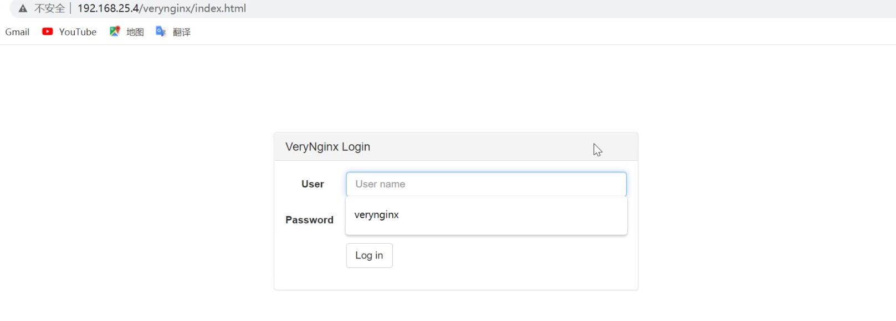

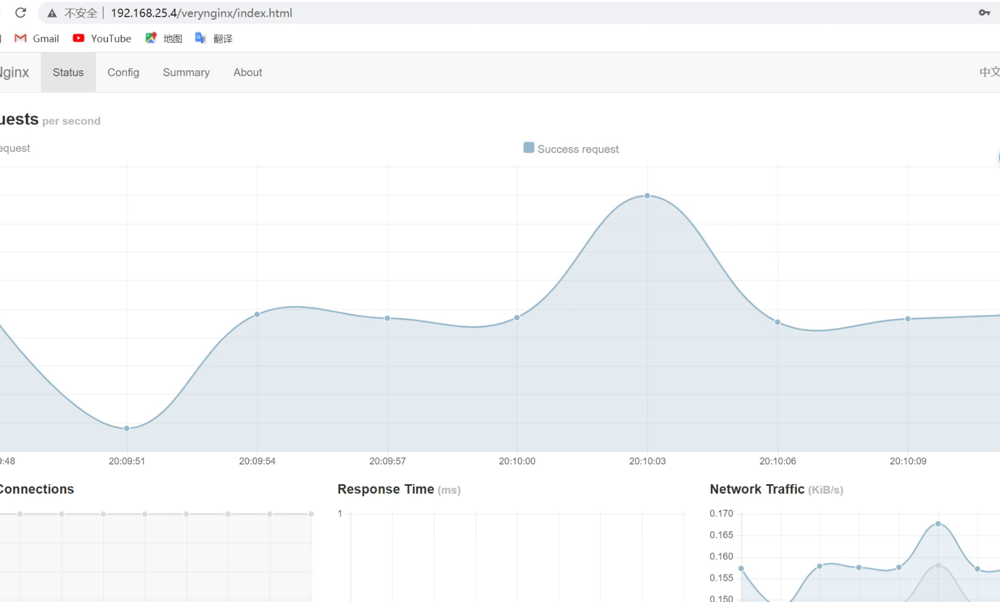

### **安装WordPress**

```bash
# WordPress需要用到数据库，所以我们要用mysql创建WordPress所需要的库
# 下载安装mysql和php
sudo apt -y install mysql-server php-fpm php-mysql
# 安装拓展
sudo apt install php-curl php-gd php-intl php-mbstring php-soap php-xml php-xmlrpc php-zip
# 安装完成之后进入mysql，输入用户密码
sudo mysql -u root -p
```
### **进入mysql创建wordpress数据库**

```mysql
mysql> CREATE USER 'wordpress'@'localhost' IDENTIFIED BY 'wordpress';
mysql> CREATE DATABASE wordpress_db;
mysql> GRANT ALL ON wordpress_db.* TO 'wordpress'@'localhost';
```

```bash
# 创建指定WordPress目录
sudo mkdir -p /var/www/wordpress/public/
# 修改该文件下的所有者为www-data
sudo chown -R www-data:www-data /var/www/wordpress/public
# 下载并解压WorePress
wget https://wordpress.org/wordpress-4.7.zip
unzip wordpress-4.7.zip
# 将wordpress文件全部拷贝刚才的public中
cp -r wordpress/* /var/www/wordpress/public/
# 进入到public文件夹
cd /var/www/wordpress/public/
# 拷贝配置文件
sudo cp wp-config-sample.php wp-config.php
# 修改wp-config.php文件中的`database_name_here`,`username_here`和`password_here`字段为数据库名称，用户名和密码。使wordpress能够访问mysql。
sudo sed -i s/database_name_here/wordpress_db/ wp-config.php
sudo sed -i s/username_here/wordpress/ wp-config.php
sudo sed -i s/password_here/wordpress/ wp-config.php
```

### **连接wordpress和nginx**

```bash
# 新建配置文件，设置端口8081和文件名wp.sec.cuc.edu.cn
sudo tee /etc/nginx/sites-available/wp.sec.cuc.edu.cn << EOF
server {
    listen 192.168.25.4:8081;
    server_name wp.sec.cuc.edu.cn;

    root /var/www/wordpress/public;
    index index.php index.html index.htm;

    location / {
        try_files \$uri \$uri/ /index.php?\$args;
    }

    location ~ \.php\$ {
        include snippets/fastcgi-php.conf;
        fastcgi_pass unix:/run/php/php7.2-fpm.sock;
    }
}
EOF
# 在sites-enabled中创建sites-available的软链接，并删除default
sudo ln -s /etc/nginx/sites-available/wp.sec.cuc.edu.cn /etc/nginx/sites-enabled/
sudo rm /etc/nginx/sites-enabled/default
# 启动nginx
sudo nginx
```

### **配置verynginx访问wp.sec.cuc.edu.cn**

```bash
# 把verynginx的配置文件目录设置为www-data用户可写,不然无法修改
sudo chown root:www-data  -R /opt/verynginx/verynginx/configs
sudo chmod -R g+w /opt/verynginx/verynginx/configs
```

- 添加wordpress_matcher

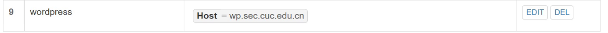

- 添加Up Stream和Proxy Pass

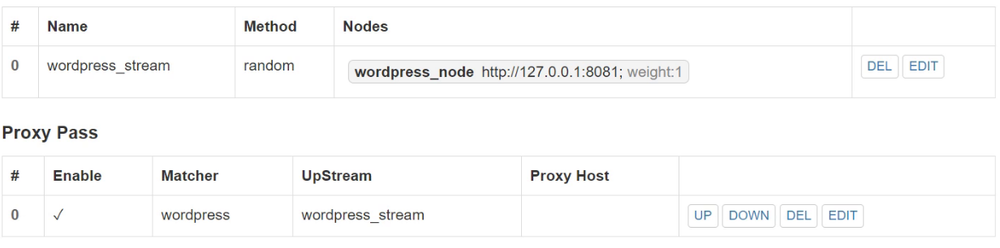

- 之后便可以通过wp.sec.cuc.edu.cn进行访问

### **安装dvwa并配置verynginx**

```bash
# 指定目录，更改所有者
sudo mkdir -p /var/www/dvwa/public/
sudo chown -R www-data:www-data /var/www/dvwa/public
# 下载解压
sudo wget https://github.com/ethicalhack3r/DVWA/archive/master.zip
unzip master.zip
# 拷贝文件到/var/www/dvwa下
sudo cp -r DVWA-master/* /var/www/dvwa/public/
cd /var/www/dvwa/public/
sudo cp config/config.inc.php.dist config/config.inc.php
# 配置文件,8082端口
sudo tee /etc/nginx/sites-available/dvwa.sec.cuc.edu.cn << EOF
server {
    listen 192.168.25.4:8082;
    server_name dvwa.sec.cuc.edu.cn;
    root /var/www/dvwa/public;
    index index.php;
    location / {
        try_files \$uri \$uri/ /index.php?\$args;
    }
    location ~ \.php\$ {
        include snippets/fastcgi-php.conf;
        fastcgi_pass unix:/run/php/php7.2-fpm.sock;
    }
}
EOF
# 设置软链接
sudo ln -s /etc/nginx/sites-available/dvwa.sec.cuc.edu.cn /etc/nginx/sites-enabled/
# 重新载入配置
sudo nginx -s reload
```

- 添加dvwa_matcher

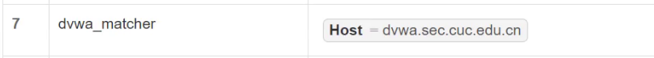

- 添加Up Stream和Proxy Pass

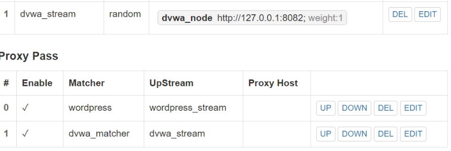

- 之后便可以通过dvwa.sec.cuc.edu.cn进行访问

</details>

<details>

**<summary>Part 2 安全加固要求</summary>**
### **使用IP地址方式均无法访问上述任意站点，并向访客展示自定义的友好错误提示信息页面-1**
- 添加`Matcher`规则

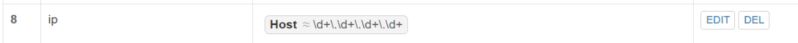

- 添加`Response`响应

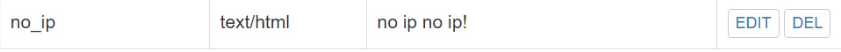

- 添加`Filter`

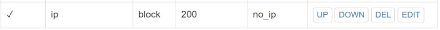

### **Damn Vulnerable Web Application (DVWA)只允许白名单上的访客来源IP，其他来源的IP访问均向访客展示自定义的友好错误提示信息页面-2**
- 添加`Matcher`规则

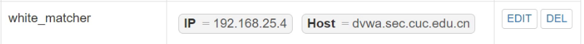

- 添加`Response`响应

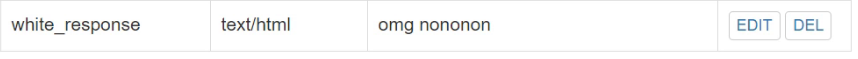

- 添加`Filter`


### **在不升级Wordpress版本的情况下，通过定制VeryNginx的访问控制策略规则，热修复WordPress < 4.7.1 - Username Enumeration**
- 添加`Matcher`规则

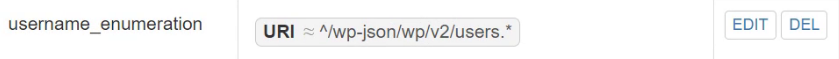

- 添加`Filter`，因为报错信息是404所以不需要另外添加response

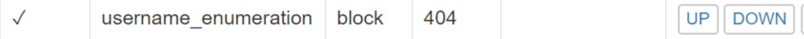

### **通过配置VeryNginx的Filter规则实现对Damn Vulnerable Web Application (DVWA)的SQL注入实验在低安全等级条件下进行防护**

- 添加`Matcher`规则

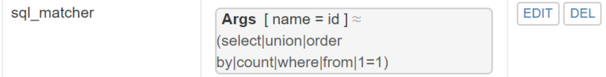

- 添加`Filter`，因为报错信息是404所以不需要另外添加response

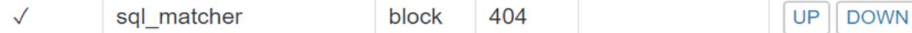


</details>

<details>

**<summary>Part 3 VeryNginx配置要求</summary>**
### **VeryNginx的Web管理页面仅允许白名单上的访客来源IP，其他来源的IP访问均向访客展示自定义的友好错误提示信息页面-3**
- 添加`Matcher`规则

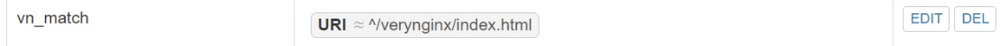


- 添加`Response`响应

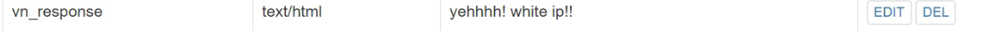

- 添加`Filter`

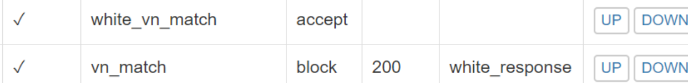

### **限制DVWA站点的单IP访问速率为每秒请求数 < 50, 限制Wordpress站点的单IP访问速率为每秒请求数 < 20, 超过访问频率限制的请求直接返回自定义错误提示信息页面-4**
- 添加`Response`响应


- 添加`Frequency Limit`

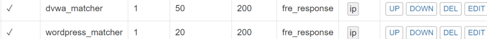

</details>

## **四、遇到的问题和解决方法**
**1. 进行`cp`备份文件时出现`permission deny`** 
- 在`cp`前加上`sudo`

**2. verynginx中无法保存**


- 把verynginx的配置文件目录设置为www-data用户可写
```bash
sudo chown root:www-data  -R /opt/verynginx/verynginx/configs
sudo chmod -R g+w /opt/verynginx/verynginx/configs
```

## **五、参考链接**
- [linux-2020-WOC-BUG](https://github.com/CUCCS/linux-2020-WOC-BUG/blob/0x05/0x05/%E7%AC%AC%E4%BA%94%E7%AB%A0%EF%BC%9AWeb%E6%9C%8D%E5%8A%A1%E5%99%A8%EF%BC%88%E5%AE%9E%E9%AA%8C%EF%BC%89.md)
- [2021-linux-public-Zhang1933](https://github.com/CUCCS/2021-linux-public-Zhang1933/blob/ch0x05/ch0x05/ch0x05.md)
- [how-to-install-wordpress-with-lemp-on-ubuntu-20-04](https://www.digitalocean.com/community/tutorials/how-to-install-wordpress-with-lemp-on-ubuntu-20-04)